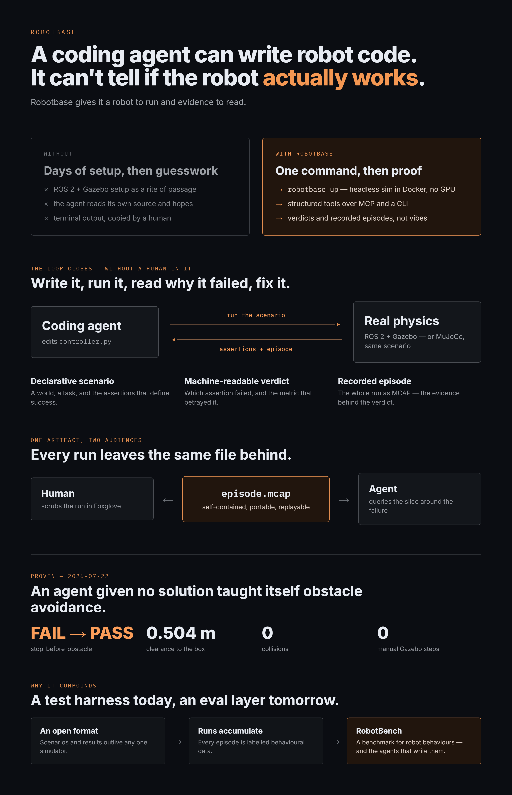

# Robotbase



**Terraform for robots — fully declarative robotics that ports from sim to real.**

Describe your robot, its sensors, its world, and the behaviours you want to verify in YAML;
Robotbase compiles that into a running (headless) simulation, runs it, and gives you
machine-readable evals + recorded data — reproducibly. Declarative config → a materialised
robotics stack, the way Terraform turns HCL into infrastructure. It removes the ROS 2 +
Gazebo setup tax, and because it's all declarative, a coding agent can build and verify the
whole thing — robots, worlds, scenarios, controllers — by natural language, over MCP and a
CLI.

Local-first and open-core. No cloud, no accounts in the core.

## How it works

You describe the robot, its sensors, the world, and the behaviours you want to verify in two
small YAML files — `robot.yaml` and `world.yaml` — plus scenarios that declare what "working"
means. Robotbase **compiles** those into a complete, runnable ROS 2 + Gazebo project (URDF, world
SDF, launch, bridges, control config) and runs it **headless**. Every run yields a machine-readable
result and a recorded MCAP episode. The whole loop is driven by a CLI and an MCP server, so a human
or a coding agent works it the same way:

```text
edit robot.yaml / world.yaml / a scenario  →  robotbase up  →  robotbase test
                       ▲                                              │
                       └────────── read the structured result / episode ──────────┘
```

## Why it makes coding agents better at robotics

Standing up ROS 2 + Gazebo by hand is a tax an agent pays in opaque C++ tracebacks and terminal
scraping. Robotbase removes it and replaces it with the things agents are actually good at:

- **Declarative, not fiddly.** The agent edits a few lines of YAML; the compiler owns every sim
  gotcha (collision lumping, scoped contact topics, bridge wiring, inertia, control config) and,
  when the spec is wrong, returns an error that *names the field* instead of a crash.
- **Structured state, not log-scraping.** `describe`, `explain`, `validate`, and the episode query
  verbs hand the agent ground truth — the compiled robot, why each artifact exists, static physics
  problems, a downsampled slice of any topic around a failure — instead of console output to parse.
- **Evidence, not vibes.** A scenario is an objective pass/fail with metrics; the agent can't *claim*
  a robot works and be believed — it has to make the assertions pass. That closes the gap the whole
  project exists to close: **a coding agent can write robot code; on its own it can't tell whether the
  robot actually works.** Robotbase gives it a robot to run and evidence to read.

*Benchmark data — coding agents with vs. without Robotbase — coming soon.*

## Quickstart

**Prerequisites:** Docker, Python 3.12, and a Linux environment. On Windows this means
**WSL2 + Docker Desktop** (WSL integration enabled); on macOS, Docker Desktop. _Developed
and tested on Windows/WSL2; other hosts should work via Docker but aren't yet verified._

```bash
# Until it's on PyPI, install from a clone:
git clone https://github.com/tomnewtoneng/robotbase.git
cd robotbase && python3 -m venv .venv && source .venv/bin/activate && pip install -e .

# Create an agent-ready project (pick a robot: differential-drive | camera-bot | arm)
robotbase create my-bot --template differential-drive
cd my-bot
robotbase up                          # start the container + build (first run builds the image)

robotbase test stop-before-obstacle   # FAILS — the starter controller ignores the LiDAR
robotbase diagnose                    # explains *why* in plain language

# Point a coding agent (e.g. Claude Code — it reads .mcp.json for the robotbase MCP tools)
# at this directory and ask it to make the scenario pass, or edit
# src/my_bot/my_bot/controller.py yourself. Then:
robotbase test stop-before-obstacle   # ...PASSES
```

## What you get

Everything runs headless in Docker (software-rendered Gazebo — no GPU required).

- **`robotbase create --template <name>`** — generate a project from a robot template:
  `differential-drive` (LiDAR), `camera-bot` (+ forward + depth camera), `arm` (a 2-DOF
  manipulator), or `drone` (a quadrotor). Emits the manifest, `AGENTS.md`, and Claude Code MCP
  config. Each template is now **compiled from declarative specs** — a `robot.yaml` and
  `world.yaml`.
- **Declarative robots & worlds (`robot.yaml` / `world.yaml`)** — describe a robot as a `parts`
  list of composable modules (`differential-drive`, `arm`, `quadrotor`) or raw links/joints, with
  sensors (`lidar`/`camera`/`depth`/`imu`/`contact`) mounting to any link; describe the world's
  ground, lights, obstacles, walls, and goals. Robotbase compiles both to URDF + SDF — you never
  hand-write the XML. Bring your own robot with **`robotbase create --from-urdf my_robot.urdf`**.
  Format: [docs/design/declarative-compiler.md](docs/design/declarative-compiler.md).
  Under the hood the compiler builds a **typed, backend-neutral semantic model**
  (`RigidBody`/`Joint`/`Sensor`/`RobotModel`); URDF, SDF, and MJCF are pure *rendering backends* over
  it — so a new description format is an additive file, not a rewrite (a MuJoCo/MJCF backend already
  proves the seam).
- **`robotbase describe`** — structured ground truth: the robot's dimensions and joints,
  the world's layout and arena bounds, and every scenario's assertions.
- **`robotbase test [--all] [--trials N]`** — run a scenario, or the whole suite; with
  `--trials` it applies **domain randomization** and reports a *robustness* score, and
  `--all` tracks behavioral **regressions** between runs.
- **`robotbase diagnose`** — plain-language *why* a run failed, correlating the failed
  assertions with the episode (collision, closest approach) and the control behaviour.
- **`robotbase episode summary | events | query`** — every run is recorded to a portable
  **MCAP** episode (Foxglove/Rerun-openable); query bounded, downsampled slices of any topic.
- **`robotbase bench`** — score the controller on **[RobotBench](docs/ROBOTBENCH.md)**, a
  versioned benchmark for robot behaviours *and the agents that write them*.
- **`robotbase doctor`** — check the environment (Docker, the runtime image, port conflicts,
  the project's container) and get pointed at the fix.
- **MCP server + CLI** — the same loop-closing operations for a coding agent or a human.

Sensors and behaviours are composable primitives (LiDAR, contact/bumper, camera, odometry;
`no_contact`, `robot_reached_pose`, `joint_positions_reached`, `minimum_path_length`, …).
The scenario/manifest/result formats are a documented, versioned spec —
[docs/SCENARIO-FORMAT.md](docs/SCENARIO-FORMAT.md).

## Sim-agnostic by design — backends are Terraform's "providers"

Robotbase is the **layer over the simulator, not a simulator**. The durable value is the
*contract* — the scenario runner, format, assertions, and results are backend-independent, so
one declarative spec targets any backend the way one Terraform config targets any cloud. The
Gazebo + ROS 2 runtime is one backend; a **MuJoCo** backend (in-process, no ROS/Docker) runs
the *same* scenario runner and format unchanged — and a **real robot** is the backend we're
building toward. See `robotbase/sim/`.

And because a scenario goal is just a target + tolerance, the same task also exposes as a
**Gymnasium RL environment** (`robotbase.sim.gym_env`) — *train and eval in one format*: a
policy trains against the env and is scored against the identical scenario through the runner.

## Status

**Alpha, and proven end-to-end.** The full local loop works (create → author the specs → build →
launch → run scenarios → read the evidence). It ships **four robot templates across three robot
classes**, a growing scenario/assertion/metric vocabulary, MCAP episode recording +
query + attachments, auto-diagnosis, `robotbase doctor`, a domain-randomized eval/suite
layer, RobotBench, a proven sim-agnostic adapter (Gazebo + MuJoCo), and a Gymnasium RL env.
~70 unit tests, code-reviewed core, MIT.

Known limitations: developed on Windows/WSL2 (other hosts untested); not yet on PyPI or a
published Docker image; the scenario library is intentionally small and growing.

## Docs

- **[STRATEGY.md](docs/STRATEGY.md) — ★ current strategic source of truth: refined vision, an honest codebase cross-reference, and the prioritized roadmap. Read this first.**
- [VISION.md](docs/VISION.md) — what Robotbase is and where it's going, strategically (supporting detail).
- [ROADMAP.md](docs/ROADMAP.md) — the build path and what's done (supporting detail).
- [IDEAS.md](docs/IDEAS.md) — the ranked expansion backlog.
- [ROBOTBENCH.md](docs/ROBOTBENCH.md) — the benchmark for robot behaviours and AI agents.
- [SCENARIO-FORMAT.md](docs/SCENARIO-FORMAT.md) — the versioned manifest/scenario/result spec.
- [VISUALIZATION.md](docs/VISUALIZATION.md) — watch runs live and replay/share episodes in Foxglove.
- [PUBLISHING.md](docs/PUBLISHING.md) — release runbook (PyPI + the runtime image).
- [CONTRIBUTING.md](CONTRIBUTING.md) — dev setup and the principles.
- [design/declarative-compiler.md](docs/design/declarative-compiler.md) — the `robot.yaml` / `world.yaml` format reference (modular robots, sensors, worlds, import).
- [design/mcap-recording.md](docs/design/mcap-recording.md) · [design/optional-visualization.md](docs/design/optional-visualization.md)
- [PROOF.md](PROOF.md) — the canonical proof: an agent teaching itself obstacle avoidance.

## License

[MIT](LICENSE). Open-core: the core is and will stay MIT-licensed.
