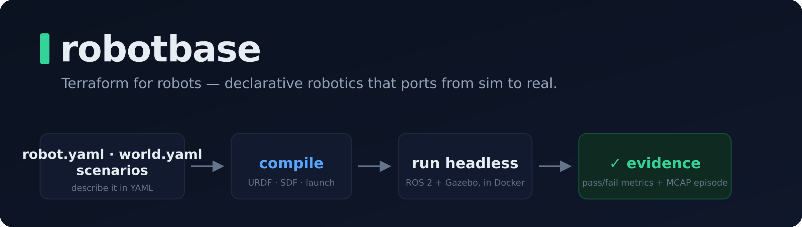

**Declarative robotics.** Describe a robot, its sensors, its world, and the behaviours you want to
verify in YAML — Robotbase compiles that into a running, **headless** ROS 2 + Gazebo simulation and
gives you machine-readable evidence. Local-first and open-core: no cloud, no accounts in the core.

## What it is

Robotbase is the *layer over the simulator*, not a simulator. It's all YAML: `robot.yaml` (the
robot + its sensors), `world.yaml` (the world), and one or more **scenario** files under
`simulation/scenarios/*.yaml`. A scenario is the test — its `assertions:` block declares what
"working" means:

```yaml
# simulation/scenarios/drive-forward.yaml
assertions:
  - {type: robot_moved_minimum_distance, minimum_distance_metres: 1.0}
  - {type: required_topic_messages, topic: /scan, minimum_count: 5}
```

Robotbase compiles all of it into a complete ROS 2 + Gazebo project (URDF, world SDF, launch,
ROS↔gz bridges, control config) and runs it headless in Docker. You never hand-write the XML —
the way you never click through a cloud console with Terraform.

## How it works

```text
edit robot.yaml / world.yaml / a scenario  →  robotbase up  →  robotbase test
                       ▲                                              │
                       └────────── read the structured result / episode ──────────┘
```

**Prerequisites:** Docker, Python 3.12, and Linux (on Windows: WSL2 + Docker Desktop).

```bash
git clone https://github.com/tomnewtoneng/robotbase.git
cd robotbase && python3 -m venv .venv && source .venv/bin/activate && pip install -e .

robotbase create my-bot --template differential-drive   # or: camera-bot | arm | drone
cd my-bot
robotbase up                    # start the container + build (first run builds the image)
robotbase test drive-forward    # runs a scenario, prints a structured pass/fail result
```

Every run is an objective result (metrics + assertions) plus a recorded **MCAP episode**
(Foxglove/Rerun-openable). It's all driven by a CLI **and an MCP server**, so a human or a coding
agent works it the same way — `create`, `describe`, `explain`, `validate`, `up`, `test`, `diagnose`,
`episode`.

## Why it exists

Standing up ROS 2 + Gazebo by hand is a tax paid in opaque C++ tracebacks and terminal scraping —
and it's especially brutal for a coding agent. Robotbase removes it and replaces it with what agents
are good at:

- **Declarative, not fiddly.** A few lines of YAML; the compiler owns every sim gotcha (collision
  lumping, bridge wiring, inertia, control config) and, when the spec is wrong, returns an error that
  *names the field* instead of a crash.
- **Structured state, not log-scraping.** `describe` / `explain` / `validate` and the episode query
  verbs hand back ground truth, not console output to parse.
- **Evidence, not vibes.** A scenario is an objective pass/fail; you can't *claim* a robot works and
  be believed — you make the assertions pass. That closes the gap the project exists to close:
  **a coding agent can write robot code; on its own it can't tell whether the robot actually works.**

*Benchmark data — coding agents with vs. without Robotbase — coming soon.*

## Status

**Alpha, proven end-to-end.** The full local loop works — create → author the specs → build →
run → read the evidence — across four robot templates (differential-drive, camera-bot, arm, drone),
a growing scenario/assertion/metric vocabulary, MCAP episode recording + query, auto-diagnosis, a
domain-randomized eval layer, and a proven sim-agnostic runner (Gazebo + an in-process MuJoCo
backend). Local-first, MIT-licensed.

## License

MIT — see [LICENSE](LICENSE).
